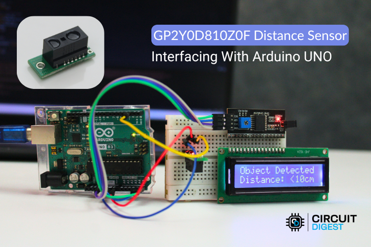
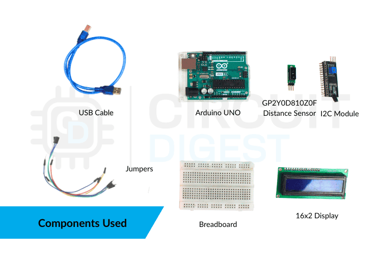
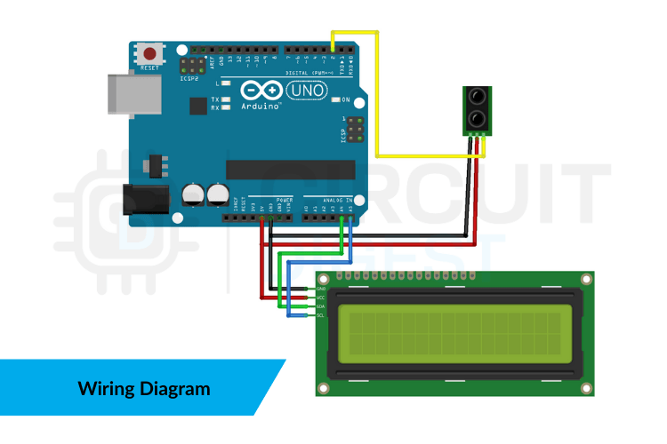
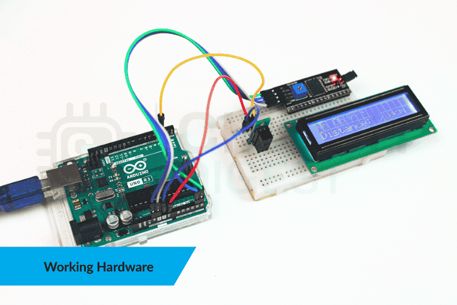

# GP2Y0D810Z0F Distance Sensor Interfacing with Arduino UNO

<p align="center">
    
  </a>
</p>

This project demonstrates how to interface the GP2Y0D810Z0F infrared proximity sensor with an Arduino UNO. The system displays the detection status on a 16x2 I2C LCD display and also prints the result on the Serial Monitor.

The GP2Y0D810Z0F is a digital IR proximity sensor that detects objects within approximately 10 cm. Instead of providing an analog distance value, it gives a simple digital HIGH or LOW output, making it very easy to integrate into embedded systems.


## Features

- Digital object detection up to 10 cm
- Simple HIGH/LOW output signal
- Real-time display on I2C LCD
- Serial Monitor output for debugging
- Easy wiring and implementation
- Reliable and stable performance

### Hardware Components Required

<p align="center">
    
    <p align="center">Components used</p>
  </a>
</p>

| Component | Quantity |
|----------|----------|
| Arduino UNO | 1 |
| GP2Y0D810Z0F IR Proximity Sensor | 1 |
| 16x2 I2C LCD Display | 1 |
| Breadboard | 1 |
| Jumper Wires | As required |
| USB Cable | 1 |

### Circuit Connections

<p align="center">
    
    <p align="center">Circuit Diagram</p>
  </a>
</p>

#### Sensor to Arduino

| Sensor Pin | Arduino Pin |
|-----------|-------------|
| VCC | 5V |
| GND | GND |
| OUT | Digital Pin 2 |

#### I2C LCD to Arduino

| LCD Pin | Arduino Pin |
|--------|-------------|
| VCC | 5V |
| GND | GND |
| SDA | A4 |
| SCL | A5 |

### Working Principle

The sensor continuously emits infrared light and checks for reflections from nearby objects.
- When an object is within approximately 10 cm, the sensor output becomes LOW.
- When no object is detected, the output remains HIGH.
The Arduino reads this digital signal and updates:
- The LCD display
- The Serial Monitor
Since the sensor handles all detection internally, the Arduino only needs to read a single digital pin, keeping the system simple and efficient.

<p align="center">
    
    <p align="center">Breadboard Image</p>
  </a>
</p>

### Source Code

This simple example reads the digital output of the GP2Y0D810Z0F sensor and displays the detection status on the Serial Monitor. It provides a minimal test program to verify basic sensor functionality.

```
// GP2Y0D810Z0F sensor pin
const int SENSOR_PIN = 2;

void setup() {
  Serial.begin(9600);
  pinMode(SENSOR_PIN, INPUT);
}

void loop() {
  int sensorState = digitalRead(SENSOR_PIN);

  if (sensorState == LOW) {
    Serial.println("Object Detected (Distance < 10cm)");
  } 
  else {
    Serial.println("No Object Detected");
  }

  delay(200);
}

```
## Applications
- Obstacle detection in robots
- Touchless activation systems
- Conveyor belt object detection
- Presence detection systems
- Industrial automation triggers
- Safety proximity monitoring

## Troubleshooting
#### LCD not showing anything
- Check the I2C address (try 0x27 or 0x3F)
- Verify SDA to A4 and SCL to A5
- Adjust LCD contrast
#### Serial Monitor not showing data
- Ensure baud rate is set to 9600
- Select the correct COM port
#### Sensor always detecting or never detecting
- Check wiring connections
- Ensure proper VCC and GND
- Avoid very dark or non-reflective surfaces
#### Unstable readings
- Keep sensor and LCD wires short
- Avoid electrical noise
- Use proper grounding

## Conclusion

Interfacing the GP2Y0D810Z0F proximity sensor with Arduino UNO provides a simple and reliable way to detect nearby objects. The digital output makes programming easy and eliminates the need for complex calculations. This project serves as a strong foundation for robotics, automation, and contactless detection systems.

The detailed tutorial is uploaded in CircuitDigest website under [Interfacing GP2Y0D80Z0F Distance Sensor with Arduino Uno](https://circuitdigest.com/microcontroller-projects/interfacing-gp2y0d80z0f-distance-sensor-with-arduino-uno).

For more exciting projects, tutorials, and circuit ideas, visit [CircuitDigest](https://www.circuitdigest.com)

---

Developed with ❤️ by the Circuit Digest Community.

If this project helped you learn something new, give it a ⭐ and share it with fellow makers. Keep building, keep learning! 🚀
